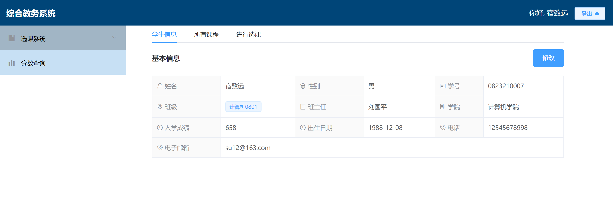
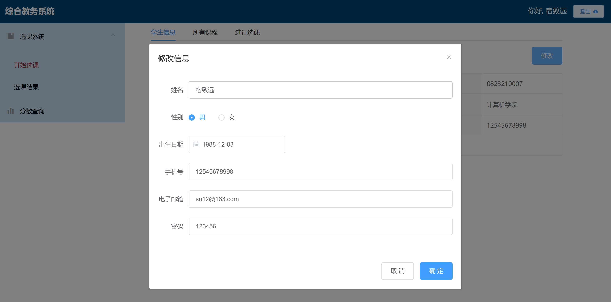
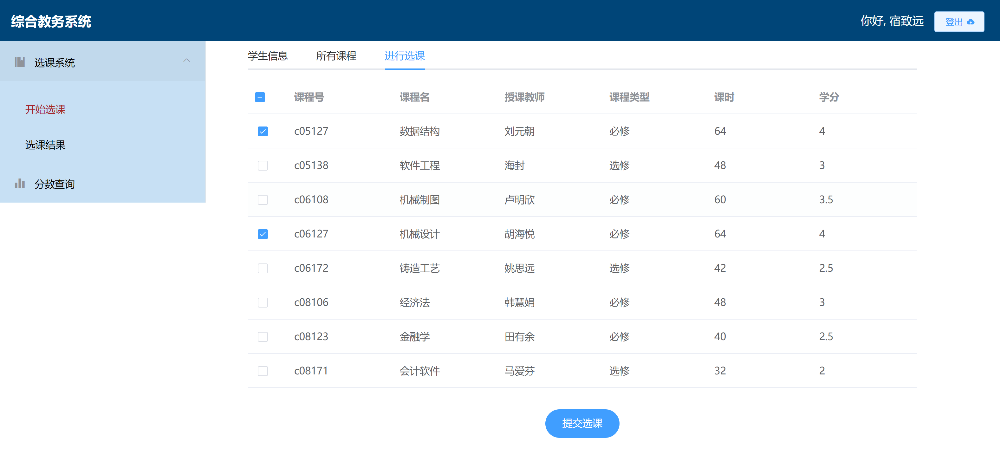

# 学生教务系统（选退课/查分功能）


## Build Setup 运行方法

``` bash
# 安装依赖 install dependencies
npm install

# 开发环境运行 serve with hot reload at localhost:8080
npm run dev

# API运行
node server\app

# 注：
# 1.需要Vue2和node.js14环境
# 2.编译代码npm run build，但是静态资源没配置好会出BUG，先不折腾了以后来填坑
```
## 主要功能

本次数据库系统原理课程设计设计并实现了一个数据库应用系统：学生选课查分系统，系统主要分为学生登录、选课管理、分数查询三大功能板块，实现了学生登陆功能、个人信息查看、个人信息修改功能、课程信息浏览功能、课程号搜索功能、选课/退课功能、个人/所有分数查询等功能。

系统的数据库采用了MySQL 5.7，展现形式为网站系统，采用Vue2+Element UI开发。

学生选课查分系统的主要需求有个人信息的查看与修改、选课信息的查看以及选退课操作、分数信息的查询。
个人信息查看与修改主要涉及查询和修改操作，学生通过学号和密码登录后，可以在首页查看自己的基本信息，同时可以修改姓名、性别、生日、密码等个人信息。
选课信息模块主要涉及查询、插入、删除操作，学生可以查看所有课程信息，可以根据课程号查询相关课程，可以在未选择过的可以中进行选课，可以查看自己已选择的课程和已经修读完的课程，可以将已选择但未修完的课程进行退课操作。
分数信息模块主要涉及查询操作，学生可以查看自己各门课程的分数和详细信息，并显示该门课程的历史平均分，也可以查看所有课程的历史均分。

## 项目目录
``` bash
jwxt
├── index.html
├── README.md
├── server  后端API
│   ├── API
│   │   ├── lesson.js 选课操作函数
│   │   ├── login.js  登录函数
│   │   └── score.js  查分操作函数
│   ├── app.js
│   ├── db
│   │   └── index.js  配置数据库
│   └── router.js     API路由注册
├── src
│   ├── App.vue
│   ├── assets
│   │   ├── css
│   │   ├── img
│   │   ├── logo.ico
│   │   └── logo.png
│   ├── components    组件
│   │   ├── AppHeader 网页头
│   │   ├── AppMain   网页内容组件
│   │   ├── AppNavbar 网页左侧导航栏组件
│   │   ├── Lesson    选课操作组件
│   │   └── Score     查分操作组件
│   ├── main.js
│   ├── router
│   │   └── index.js  组件路由配置
│   ├── store
│   │   └── index.js  Vuex-store配置
│   ├── util
│   │   └── util.js
│   └── views         页面框架
│       ├── home.vue
│       └── login.vue
└── vue.config.js
```
## 网页预览





